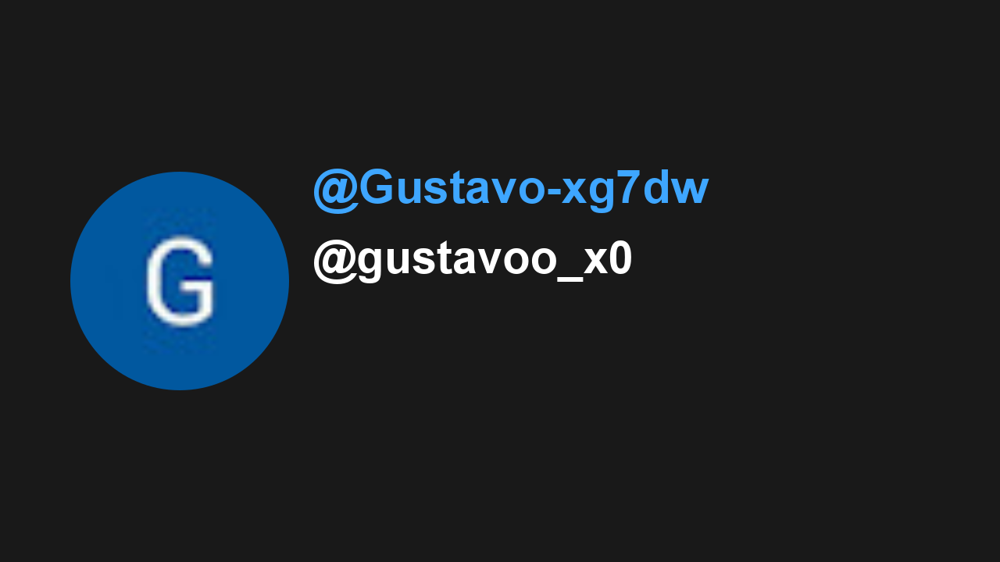

# 🎥 Youtube Thumbnail

YoutubeThumbnail is a project that transforms the latest comment on a YouTube video into its thumbnail. A creative and interactive way to engage your viewers!

## 🎬 Demo

Access the video here:

## 🎴 Last Thumbnail

## 🚀 Features

- Captures the latest comment from a YouTube video
- Censures the comment using AI
- Automatically converts this comment into a thumbnail image using javascript and canvas
- Updates the video thumbnail with the selected comment
- Creates an interactive experience where viewers can influence the appearance of the video

## 🔧 Usage

Just fork this repo and configure it with your own credentials:

1. Clone the repository to your local machine
2. Create a `.env` file with the following variables:

   - `YOUTUBE_API_KEY` - Your YouTube Data API key
   - `YOUTUBE_VIDEO_ID` - The ID of your YouTube video to monitor
   - `GEMINI_API_KEY` - Your Google Gemini API key for content moderation
   - `GOOGLE_CLIENT_ID` - Your Google Console client ID
   - `GOOGLE_CLIENT_SECRET` - Your Google Console client secret
   - `GOOGLE_ACCESS_TOKEN` - Your OAuth access token
   - `GOOGLE_REFRESH_TOKEN` - Your OAuth refresh token

3. Install dependencies with `npm install`
4. Run the project with `npm start`
5. The system will automatically check for new comments, update the thumbnail, and commit changes to README

Remember to set up the appropriate permissions in Google Cloud Console for YouTube Data API and provide the necessary OAuth scopes for your application.

## 🤙 Thanks!

This code sucks! Enjoy it!
